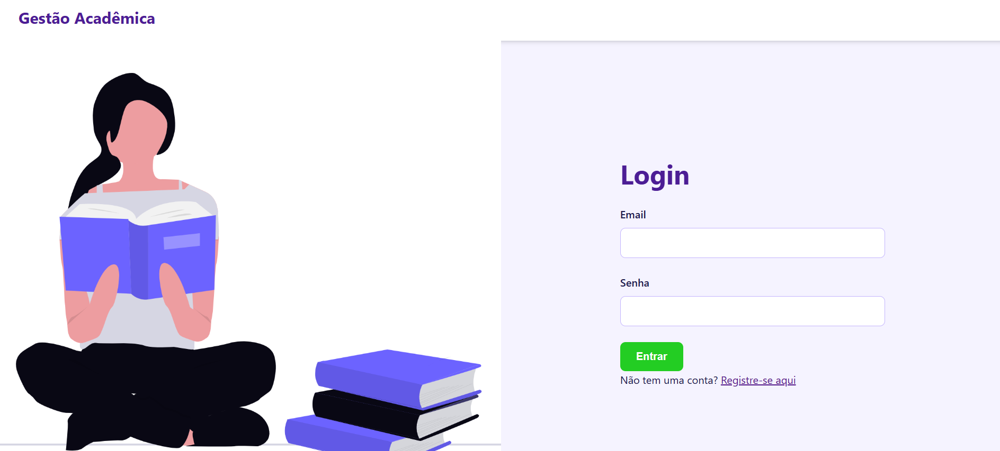
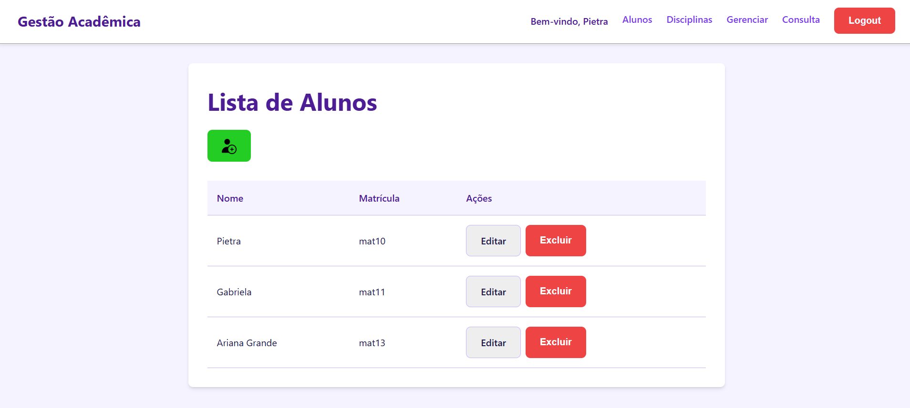
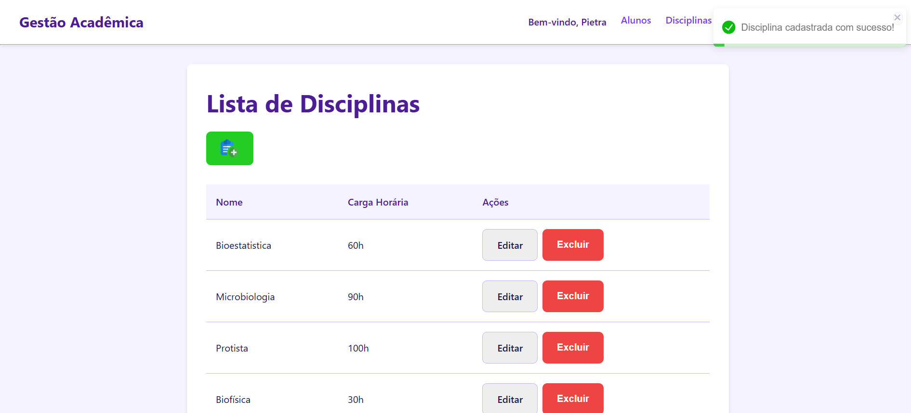
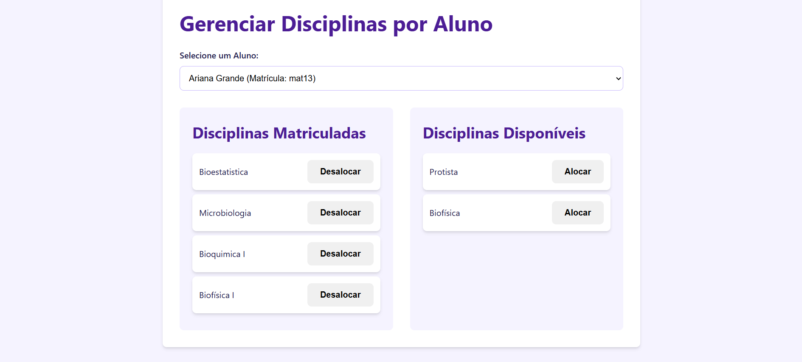
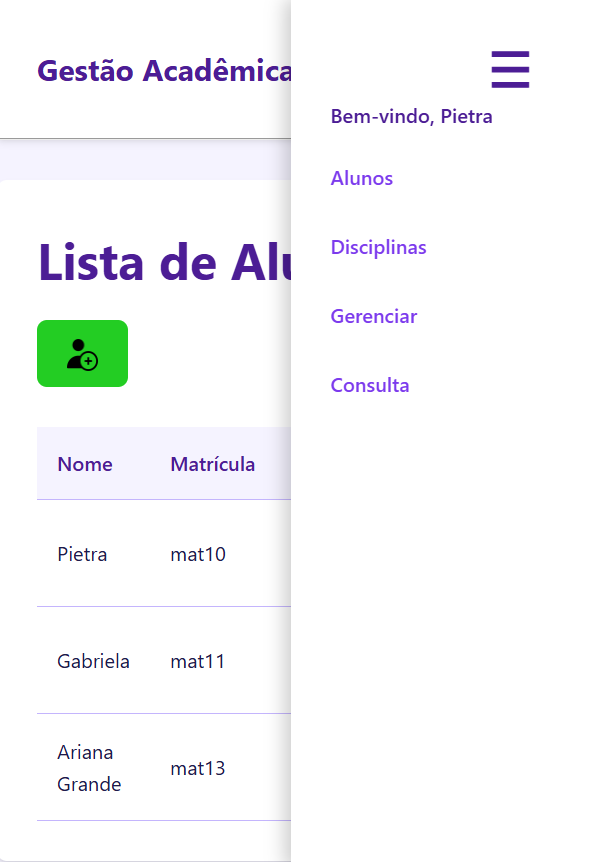

# Gestão Acadêmica - Sistema Full-Stack
Este é um projeto full-stack de um sistema de gestão acadêmica, desenvolvido como um exercício prático para cobrir todas as etapas do desenvolvimento web moderno, desde o back-end com API RESTful até o front-end com React.

A aplicação permite que diferentes usuários se cadastrem e gerenciem seus próprios alunos e disciplinas.

📸 Preview da Aplicação

✨ Funcionalidades Principais
Autenticação de Usuários: Sistema completo de registro e login com senhas criptografadas e tokens de acesso (JWT).

Privacidade de Dados: Cada usuário só pode ver e gerenciar os dados (alunos e disciplinas) que ele mesmo criou.

CRUD de Alunos: Funcionalidade completa para Criar, Ler, Atualizar e Deletar alunos.

CRUD de Disciplinas: Funcionalidade completa para Criar, Ler, Atualizar e Deletar disciplinas.

Gerenciamento de Matrículas: Uma interface para alocar e desalocar disciplinas para alunos (relação Muitos-para-Muitos).

Consulta por Matrícula: Uma tela para buscar um aluno pela sua matrícula e ver as disciplinas que ele cursa.

Interface Responsiva: O layout se adapta a diferentes tamanhos de tela, com um menu hambúrguer para dispositivos móveis.

Feedback ao Usuário: Notificações (toasts) para ações bem-sucedidas ou erros, e modais de confirmação para ações destrutivas.

🛠️ Tecnologias Utilizadas

### Back-end

Node.js: Ambiente de execução JavaScript no servidor.

Express.js: Framework para criação da API RESTful.

MongoDB: Banco de dados NoSQL para armazenamento dos dados.

Mongoose: ODM para modelagem e comunicação com o MongoDB.

JSON Web Tokens (JWT): Para geração de tokens de autenticação.

Bcrypt.js: Para criptografia de senhas.

### Front-end

React: Biblioteca para construção da interface de usuário.

React Router: Para gerenciamento de rotas e navegação.

Axios: Para fazer as requisições HTTP para o back-end.

React Toastify: Para exibir notificações (toasts).

CSS Puro: Estilização customizada com Flexbox e Media Queries para responsividade.

🚀 Instalação e Execução
Siga os passos abaixo para rodar o projeto localmente.

Pré-requisitos
Node.js (versão 16 ou superior)

NPM (geralmente instalado com o Node.js)

Uma instância do MongoDB (você pode usar o MongoDB Atlas para criar um banco de dados na nuvem gratuitamente).

1. Clone o Repositório
Bash

git clone https://github.com/samaraporto/gestao_academica
cd nome-do-repositorio
2. Configure o Back-end 🍳
Navegue até a pasta do back-end:

Bash

cd back
Instale as dependências:

Bash

npm install
Crie um arquivo .env na raiz da pasta back e adicione as seguintes variáveis. Substitua os valores pelos seus.

Snippet de código

# Crie uma chave secreta longa e aleatória para proteger seus tokens
JWT_SECRET=SEGREDO_SUPER_SECRETO_PARA_PROTEGER_O_TOKEN

# Sua string de conexão do MongoDB Atlas
MONGO_URI=mongodb+srv://<user>:<password>@cluster.mongodb.net/suaDatabase?retryWrites=true&w=majority
(Dica: Para o JWT_SECRET, você pode usar um gerador de senhas online para criar uma string forte)

3. Configure o Front-end 🍽️
Em outro terminal, navegue até a pasta do front-end:

Bash: cd front-novo # ou o nome que você deu para a pasta
Instale as dependências:

Bash: npm install
O front-end já está configurado para rodar na porta 3000 e se comunicar com o back-end na porta 3001.

4. Rodando a Aplicação ▶️
Inicie o servidor back-end (no terminal da pasta back):

Bash: node app.js
Você deverá ver a mensagem "Servidor ativo na porta 3001" e "conectado ao mongodb".

Inicie a aplicação front-end (no terminal da pasta front-novo):

Bash: npm start
Seu navegador abrirá automaticamente em http://localhost:3000.

Agora você pode registrar um novo usuário, fazer login e utilizar todas as funcionalidades do sistema!